# Data Ingestion Script Explained

This document explains how `ingest_data.py` works in simple terms. The script takes text files (like pages from a PDF) and converts them into a searchable database using vector embeddings.

## Table of Contents
- [Overview](#overview)
- [How It Works](#how-it-works)
- [Code Walkthrough](#code-walkthrough)
- [Data Flow](#data-flow)

## Overview

The data ingestion script performs three main tasks:
1. **Loads** text files from a directory
2. **Splits** large text into smaller chunks (optional)
3. **Creates** a vector database for fast semantic search


## How It Works

### What are Vector Embeddings?

Vector embeddings convert text into numbers (vectors) that capture meaning. Similar text has similar vectors, allowing computers to understand semantic relationships.

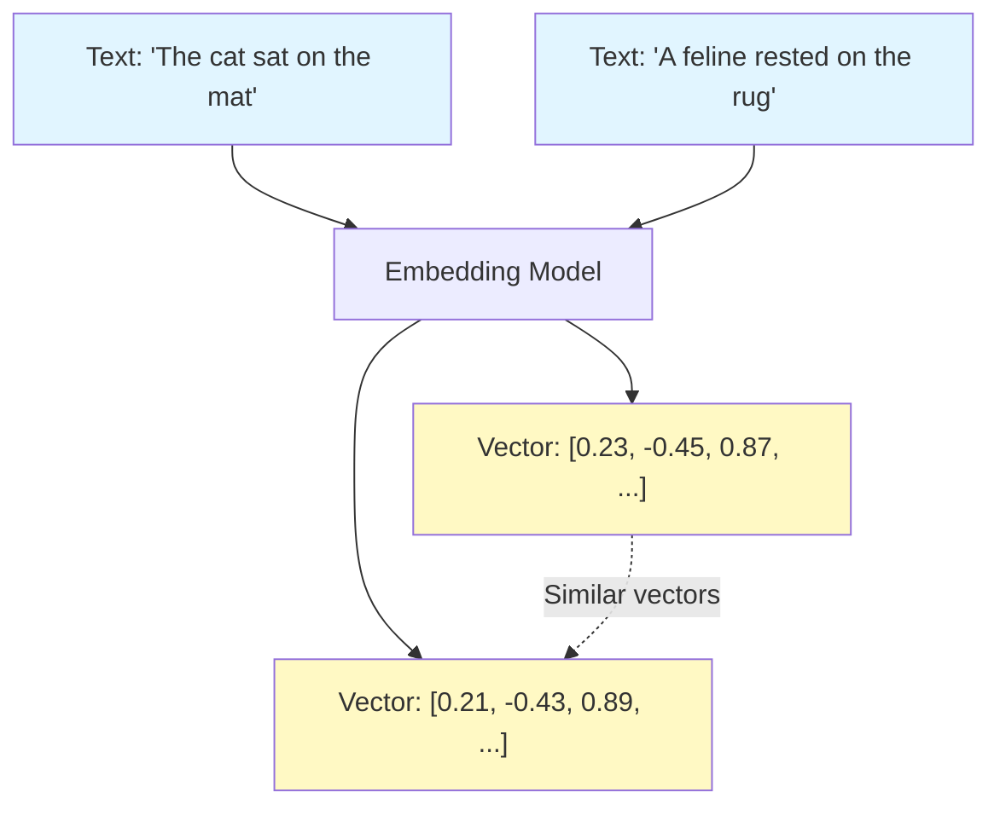

### Why Split Text into Chunks?

Large documents are split into smaller chunks for better retrieval accuracy. When you ask a question, the system finds the most relevant chunks rather than entire documents.

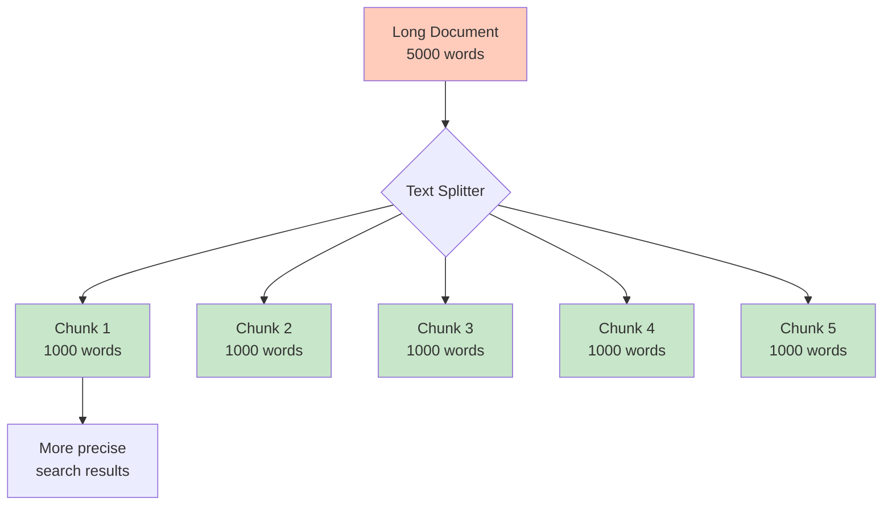

## Code Walkthrough

### 1. Imports and Dependencies

```python
from langchain_ollama import OllamaEmbeddings
from langchain_chroma import Chroma
from langchain_core.documents import Document
from langchain_text_splitters import RecursiveCharacterTextSplitter
```

**What these do:**
- `OllamaEmbeddings`: Connects to Ollama to generate vector embeddings
- `Chroma`: Vector database for storing and searching embeddings
- `Document`: LangChain's document format that holds text + metadata
- `RecursiveCharacterTextSplitter`: Smart text splitter that preserves context

### 2. Class Initialization (`__init__` method)

**Location:** Lines 17-48

**What it does:** Sets up the ingestion pipeline with configuration

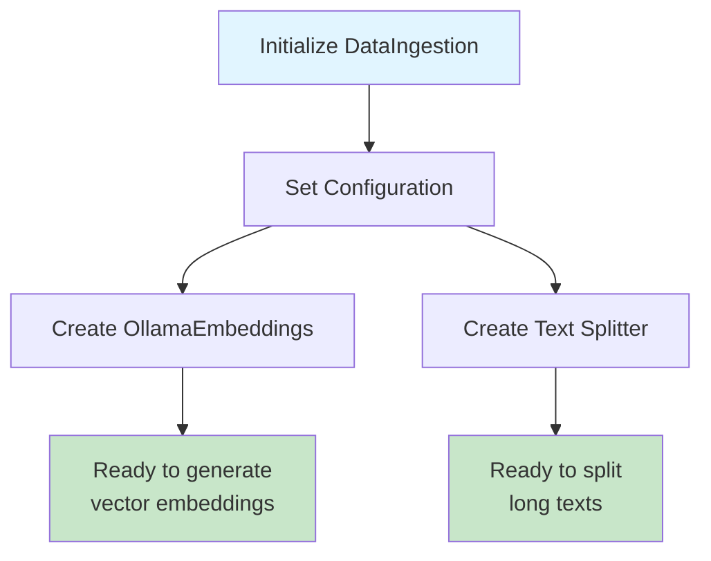

**Key parameters:**
- `data_directory`: Where your .txt files are located
- `chroma_db_path`: Where to save the vector database
- `embedding_model`: Which model to use (default: mxbai-embed-large)
- `chunk_size`: How many characters per chunk (default: 1000)
- `chunk_overlap`: How much chunks overlap (default: 200)

**Why overlap?** Overlapping ensures important information at chunk boundaries isn't lost.


### 3. Loading Text Files (`load_text_files` method)

**Location:** Lines 58-103

**What it does:** Reads all .txt files and creates Document objects

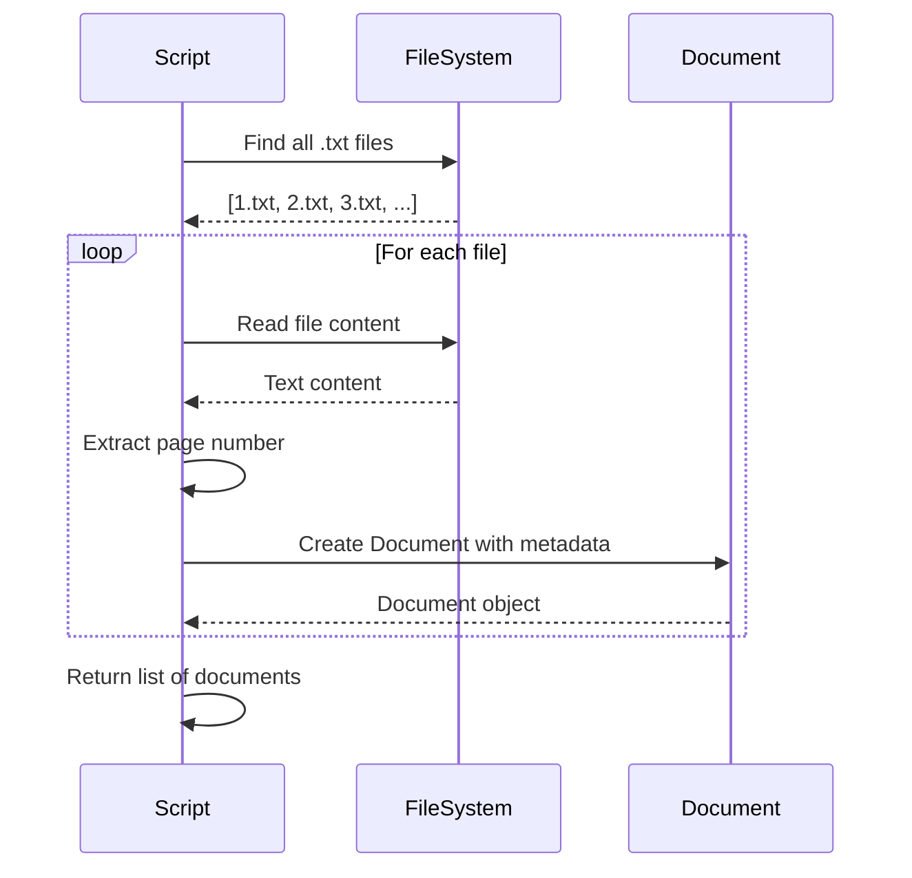

**File naming:** Files are expected to be named by page number (e.g., `1.txt`, `2.txt`, `3.txt`)

**Metadata stored:**
- `source`: Original filename
- `page`: Page number extracted from filename
- `file_path`: Full path to the file

### 4. Extracting Page Numbers (`_extract_page_number` method)

**Location:** Lines 105-119

**What it does:** Uses regex to extract the number from filenames like "42.txt"

```mermaid
graph LR
    A["Filename: '42.txt'"] --> B[Regex Pattern:<br/>r'(\d+)\.txt$']
    B --> C[Extract: '42']
    C --> D[Convert to int: 42]

    style A fill:#e1f5ff
    style D fill:#c8e6c9
```

### 5. Splitting Documents (`split_documents` method)

**Location:** Lines 121-137

**What it does:** Breaks large documents into smaller chunks while preserving context

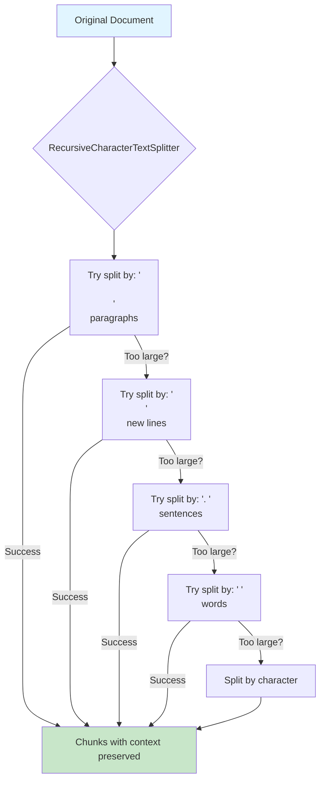

**How RecursiveCharacterTextSplitter works:**
1. Tries to split at natural boundaries (paragraphs first)
2. Falls back to smaller boundaries if needed (sentences, then words)
3. Ensures each chunk is approximately `chunk_size` characters
4. Adds overlap between chunks to preserve context

### 6. Creating the Vector Store (`create_vectorstore` method)

**Location:** Lines 139-163

**What it does:** Generates embeddings and stores them in Chroma database

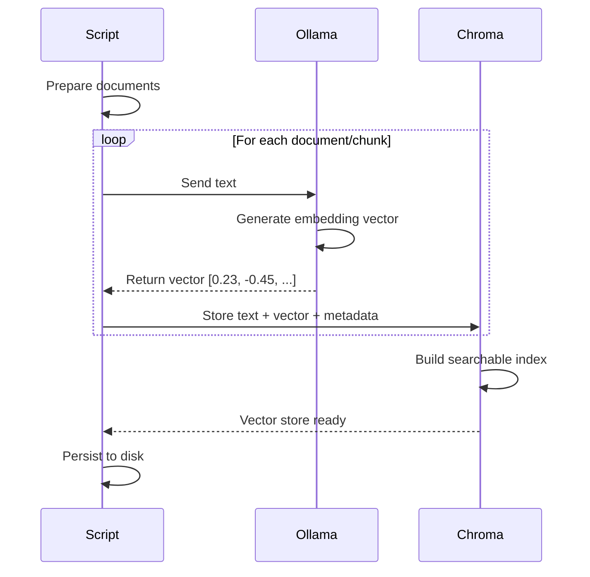

**What happens:**
1. Each text chunk is sent to Ollama's embedding model
2. The model returns a vector (array of numbers) representing the meaning
3. The vector, text, and metadata are stored in Chroma
4. Chroma builds an index for fast similarity search
5. Everything is saved to disk at `chroma_db_path`

**Vector representation:**
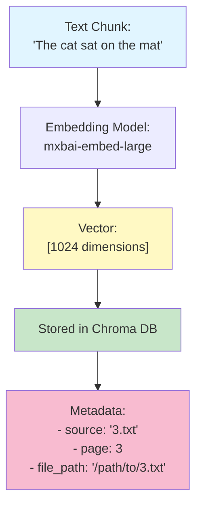

### 7. Full Ingestion Pipeline (`ingest` method)

**Location:** Lines 165-202

**What it does:** Orchestrates the entire process

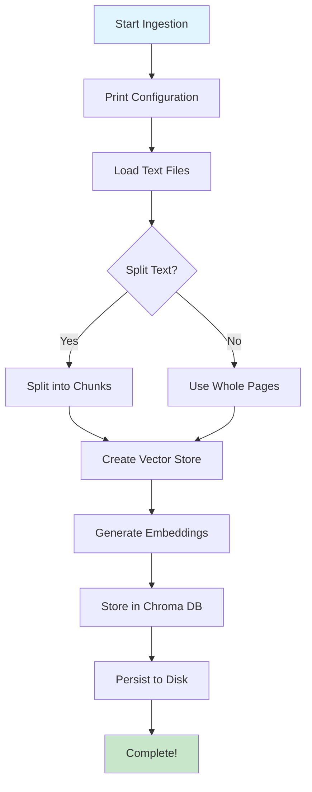

### 8. Command-Line Interface (`main` function)

**Location:** Lines 205-240

**What it does:** Parses command-line arguments and runs ingestion

**Available arguments:**
- `data_dir` (required): Directory with text files
- `--db-path`: Where to save the database
- `--embedding-model`: Which embedding model to use
- `--ollama-url`: URL of Ollama server
- `--chunk-size`: Size of text chunks
- `--chunk-overlap`: Overlap between chunks
- `--no-split`: Don't split text, use whole pages

## Data Flow

### Complete Process Flow

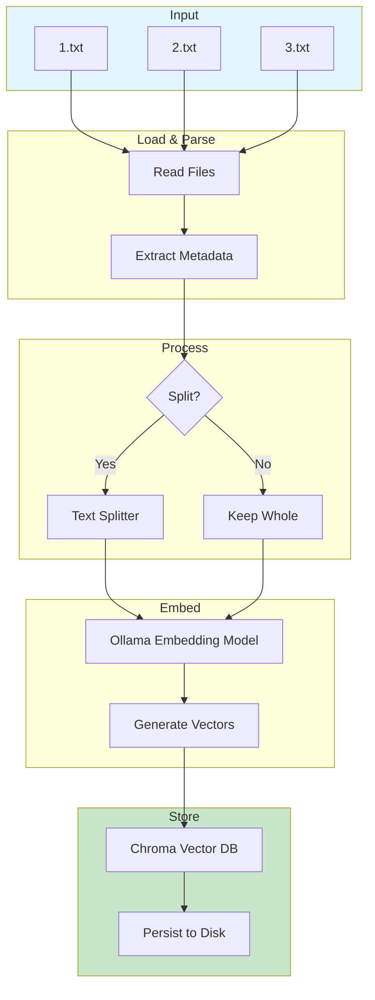

### Vector Database Structure

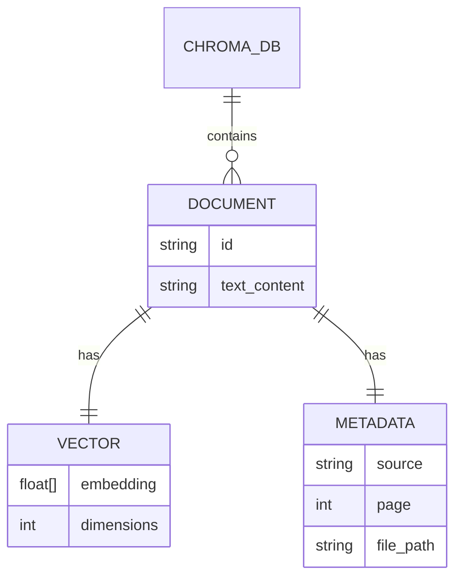

## Key Concepts Explained

### 1. Why Use Embeddings?

Traditional search uses keyword matching. Vector embeddings understand meaning:

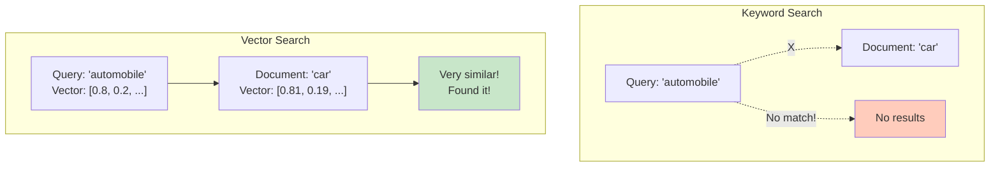

### 2. Chunk Overlap Illustration

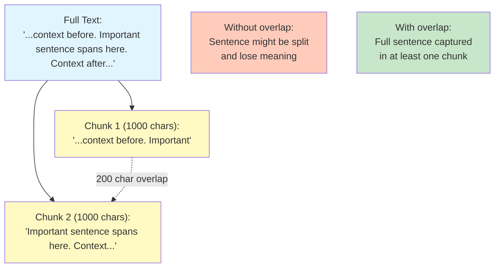

### 3. From Text to Searchable Database

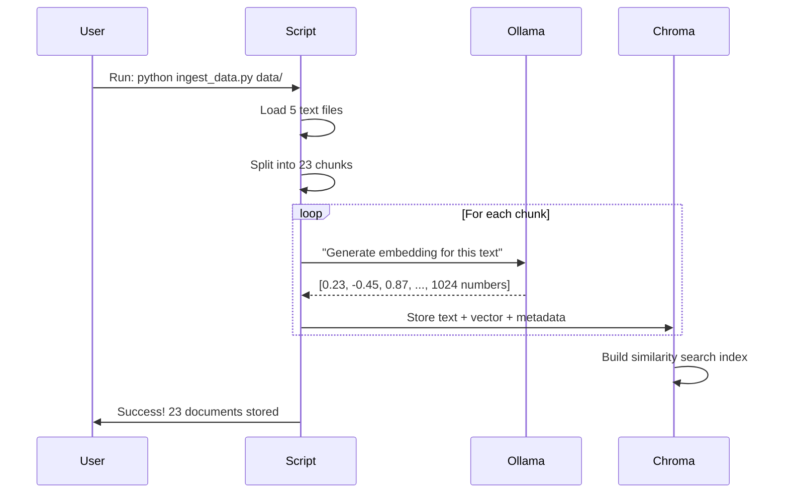

## Example Usage

### Basic Usage
```bash
python ingest_data.py ./my_documents/
```

### With Custom Settings
```bash
python ingest_data.py ./my_documents/ \
  --db-path ./custom_db \
  --chunk-size 500 \
  --chunk-overlap 100 \
  --embedding-model mxbai-embed-large
```

### Without Splitting (Whole Pages)
```bash
python ingest_data.py ./my_documents/ --no-split
```

## What Gets Created

After running the ingestion script:

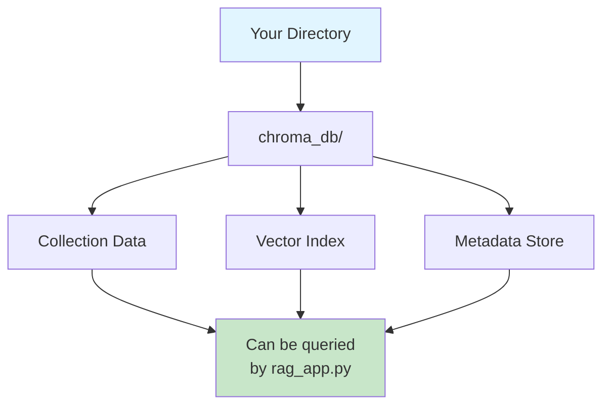

The `chroma_db/` directory contains:
- Vector embeddings for all text chunks
- Original text content
- Metadata (source file, page number)
- Searchable index for fast similarity search

## Summary

The ingestion script transforms unstructured text files into a searchable knowledge base:

1. **Reads** text files with page numbers
2. **Splits** long text into manageable chunks (optional)
3. **Converts** text to vector embeddings using Ollama
4. **Stores** everything in a Chroma vector database
5. **Enables** semantic search by the RAG application

This creates a foundation for intelligent question-answering based on your documents!
