# RAG Application Explained

This document explains how `rag_app.py` works in simple terms. The script enables you to ask questions about your documents and get intelligent answers using a Retrieval-Augmented Generation (RAG) approach.

## Table of Contents
- [Overview](#overview)
- [What is RAG?](#what-is-rag)
- [How It Works](#how-it-works)
- [Code Walkthrough](#code-walkthrough)
- [Query Flow](#query-flow)

## Overview

The RAG application performs three main tasks:
1. **Retrieves** relevant text chunks from the vector database
2. **Augments** your question with the retrieved context
3. **Generates** an answer using a language model

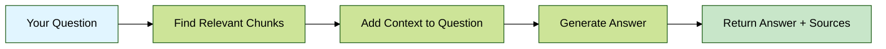
```mermaid
---
config:
  theme: 'forest'
---
graph LR
    A[Your Question] --> B[Find Relevant Chunks]
    B --> C[Add Context to Question]
    C --> D[Generate Answer]
    D --> E[Return Answer + Sources]

    style A fill:#e1f5ff
    style E fill:#c8e6c9
```

## What is RAG?

RAG stands for **Retrieval-Augmented Generation**. It combines two powerful techniques:

### Traditional LLM (Without RAG)
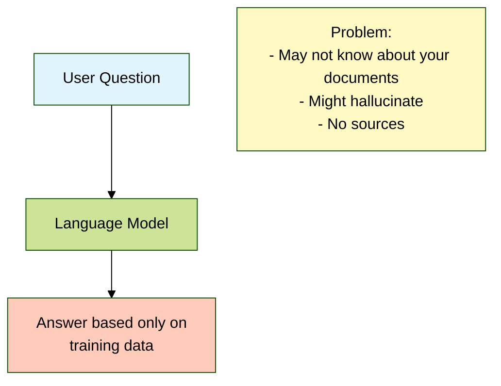
```mermaid
---
config:
  theme: 'forest'
---
graph TD
    A[User Question] --> B[Language Model]
    B --> C[Answer based only on<br/>training data]

    D[Problem:<br/>- May not know about your documents<br/>- Might hallucinate<br/>- No sources]

    style A fill:#e1f5ff
    style C fill:#ffccbc
    style D fill:#fff9c4
```

### RAG Approach (With RAG)
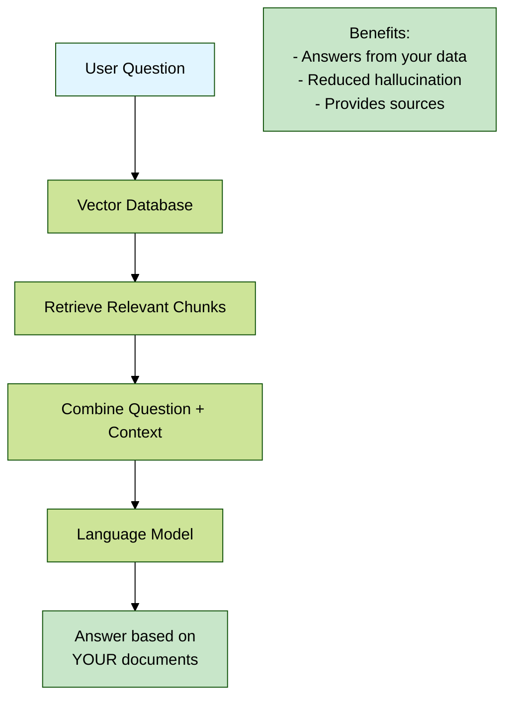
```mermaid
---
config:
  theme: 'forest'
---
graph TD
    A[User Question] --> B[Vector Database]
    B --> C[Retrieve Relevant Chunks]
    C --> D[Combine Question + Context]
    D --> E[Language Model]
    E --> F[Answer based on<br/>YOUR documents]

    G[Benefits:<br/>- Answers from your data<br/>- Reduced hallucination<br/>- Provides sources]

    style A fill:#e1f5ff
    style F fill:#c8e6c9
    style G fill:#c8e6c9
```

## How It Works

### The RAG Process Step-by-Step

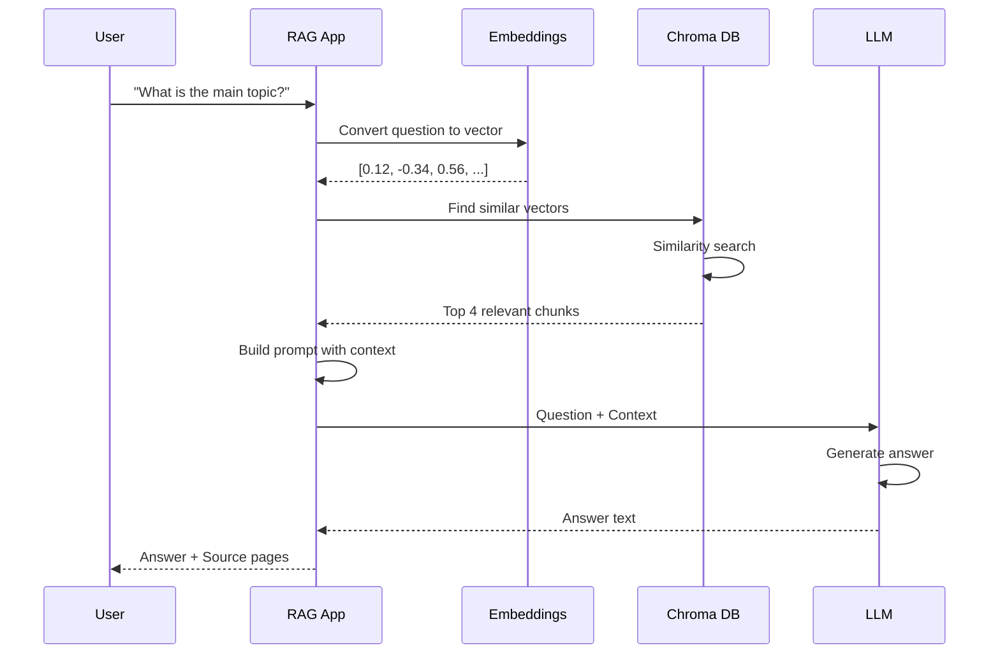
```mermaid
sequenceDiagram
    participant User
    participant RAG App
    participant Embeddings
    participant Chroma DB
    participant LLM

    User->>RAG App: "What is the main topic?"

    RAG App->>Embeddings: Convert question to vector
    Embeddings-->>RAG App: [0.12, -0.34, 0.56, ...]

    RAG App->>Chroma DB: Find similar vectors
    Chroma DB->>Chroma DB: Similarity search
    Chroma DB-->>RAG App: Top 4 relevant chunks

    RAG App->>RAG App: Build prompt with context

    RAG App->>LLM: Question + Context
    LLM->>LLM: Generate answer
    LLM-->>RAG App: Answer text

    RAG App-->>User: Answer + Source pages
```

### Similarity Search Explained

When you ask a question, the system finds the most similar text chunks:

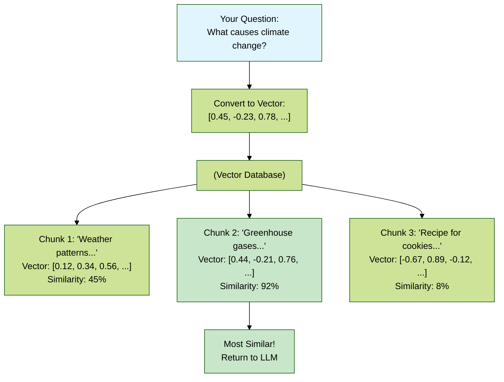
```mermaid
---
config:
  theme: 'forest'
---
graph TD
    A["Your Question:<br />What causes climate change?"] --> B["Convert to Vector:<br />[0.45, -0.23, 0.78, ...]"]

    C["(Vector Database)"]
    D["Chunk 1: 'Weather patterns...'<br/>Vector: [0.12, 0.34, 0.56, ...]<br/>Similarity: 45%"]
    E["Chunk 2: 'Greenhouse gases...'<br/>Vector: [0.44, -0.21, 0.76, ...]<br/>Similarity: 92%"]
    F["Chunk 3: 'Recipe for cookies...'<br/>Vector: [-0.67, 0.89, -0.12, ...]<br/>Similarity: 8%"]

    B --> C
    C --> D
    C --> E
    C --> F

    E --> G[Most Similar!<br/>Return to LLM]

    style A fill:#e1f5ff
    style E fill:#c8e6c9
    style G fill:#c8e6c9
```

## Code Walkthrough

### 1. Imports and Dependencies

```python
from langchain_ollama import OllamaLLM, OllamaEmbeddings
from langchain_chroma import Chroma
from langchain_core.prompts import ChatPromptTemplate
from langchain_core.runnables import RunnablePassthrough, RunnableParallel
from langchain_core.output_parsers import StrOutputParser
```

**What these do:**
- `OllamaLLM`: Connects to Ollama for text generation (e.g., llama3.2)
- `OllamaEmbeddings`: Converts text to vectors for similarity search
- `Chroma`: Loads the vector database created by ingestion
- `ChatPromptTemplate`: Formats prompts with context
- `RunnablePassthrough`/`RunnableParallel`: LangChain's way to chain operations
- `StrOutputParser`: Extracts the text answer from the LLM response

### 2. Class Initialization (`__init__` method)

**Location:** Lines 15-52

**What it does:** Sets up the RAG pipeline

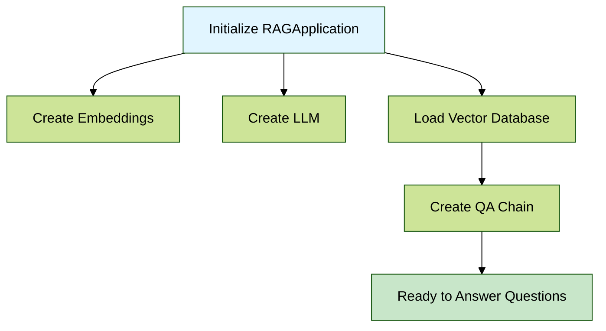
```mermaid
---
config:
  theme: 'forest'
---
graph TD
    A[Initialize RAGApplication] --> B[Create Embeddings]
    A --> C[Create LLM]
    A --> D[Load Vector Database]

    D --> E[Create QA Chain]

    E --> F[Ready to Answer Questions]

    style A fill:#e1f5ff
    style F fill:#c8e6c9
```

**Key components created:**
1. **Embeddings**: Same model used during ingestion (mxbai-embed-large)
2. **LLM**: Language model for generating answers (default: llama3.2)
3. **Vector Store**: Loads the Chroma database
4. **QA Chain**: Pipeline that coordinates retrieval and generation

### 3. Loading the Vector Store (`_load_vectorstore` method)

**Location:** Lines 54-68

**What it does:** Connects to the Chroma database created during ingestion

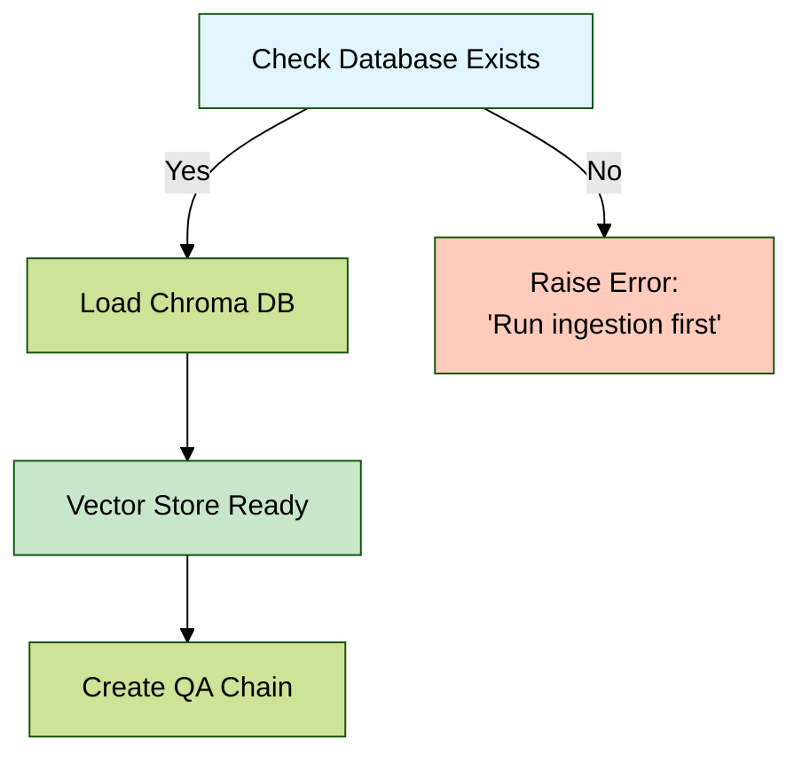
```mermaid
---
config:
  theme: 'forest'
---
graph TD
    A[Check Database Exists] -->|Yes| B[Load Chroma DB]
    A -->|No| C[Raise Error:<br/>'Run ingestion first']

    B --> D[Vector Store Ready]
    D --> E[Create QA Chain]

    style A fill:#e1f5ff
    style D fill:#c8e6c9
    style C fill:#ffccbc
```

**Important:** The same embedding model must be used for both ingestion and querying. Otherwise, the vectors won't be compatible!

### 4. Creating the QA Chain (`_create_qa_chain` method)

**Location:** Lines 70-111

**What it does:** Builds a pipeline using LangChain Expression Language (LCEL)

This is the heart of the RAG system. Let's break it down:

#### The Prompt Template

```python
template = """Use the following pieces of context to answer the question at the end.
If you don't know the answer based on the context provided, just say that you don't know,
don't try to make up an answer.

Context:
{context}

Question: {question}

Answer: """
```

**How it works:**

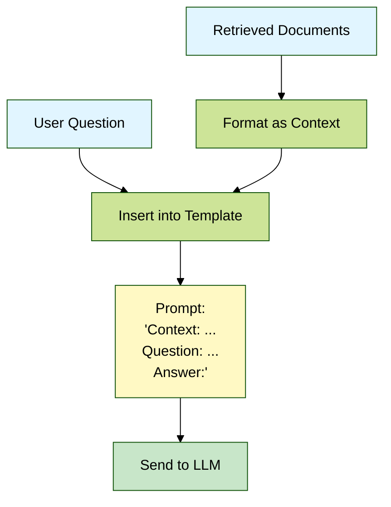
```mermaid
---
config:
  theme: 'forest'
---
graph TD
    A[Retrieved Documents] --> B[Format as Context]
    C[User Question] --> D[Insert into Template]
    B --> D

    D --> E["Prompt:<br/>'Context: ...<br/>Question: ...<br/>Answer:'"]

    E --> F[Send to LLM]

    style A fill:#e1f5ff
    style C fill:#e1f5ff
    style E fill:#fff9c4
    style F fill:#c8e6c9
```

#### The LCEL Chain

**Location:** Lines 98-108

This is a sophisticated pipeline that processes your question:

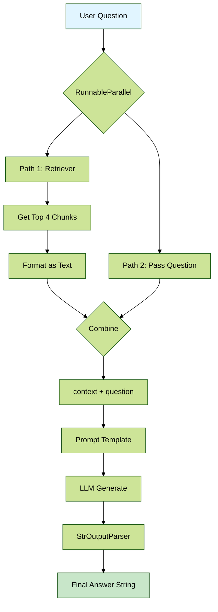
```mermaid
---
config:
  theme: 'forest'
---
flowchart TD
    A[User Question] --> B{RunnableParallel}

    B --> C[Path 1: Retriever]
    B --> D[Path 2: Pass Question]

    C --> E[Get Top 4 Chunks]
    E --> F[Format as Text]

    F --> G{Combine}
    D --> G

    G --> H[context + question]

    H --> I[Prompt Template]
    I --> J[LLM Generate]
    J --> K[StrOutputParser]
    K --> L[Final Answer String]

    style A fill:#e1f5ff
    style L fill:#c8e6c9
```

**Code breakdown:**

```python
self.qa_chain = (
    # Step 1: Run retrieval and question in parallel
    RunnableParallel({
        "context": retriever | format_docs,  # Get docs, then format
        "question": RunnablePassthrough()     # Pass question through
    })
    # Step 2: Fill in the prompt template
    | prompt
    # Step 3: Generate answer with LLM
    | self.llm
    # Step 4: Extract the text
    | StrOutputParser()
)
```

**Visual representation of the chain:**

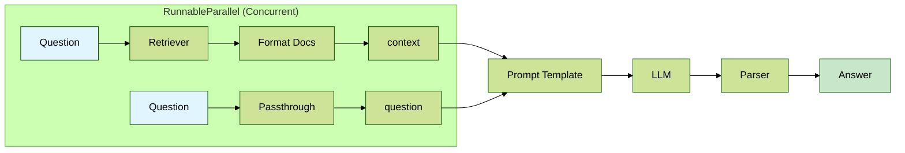
```mermaid
---
config:
  theme: 'forest'
---
graph LR
    subgraph "RunnableParallel (Concurrent)"
        A1[Question] --> B1[Retriever]
        B1 --> C1[Format Docs]
        C1 --> D1[context]

        A2[Question] --> E1[Passthrough]
        E1 --> F1[question]
    end

    D1 --> G[Prompt Template]
    F1 --> G

    G --> H[LLM]
    H --> I[Parser]
    I --> J[Answer]

    style A1 fill:#e1f5ff
    style A2 fill:#e1f5ff
    style J fill:#c8e6c9
```

#### The Retriever

**Location:** Lines 92-94

```python
retriever = self.vectorstore.as_retriever(
    search_kwargs={"k": 4}  # Retrieve top 4 most relevant chunks
)
```

**How retrieval works:**

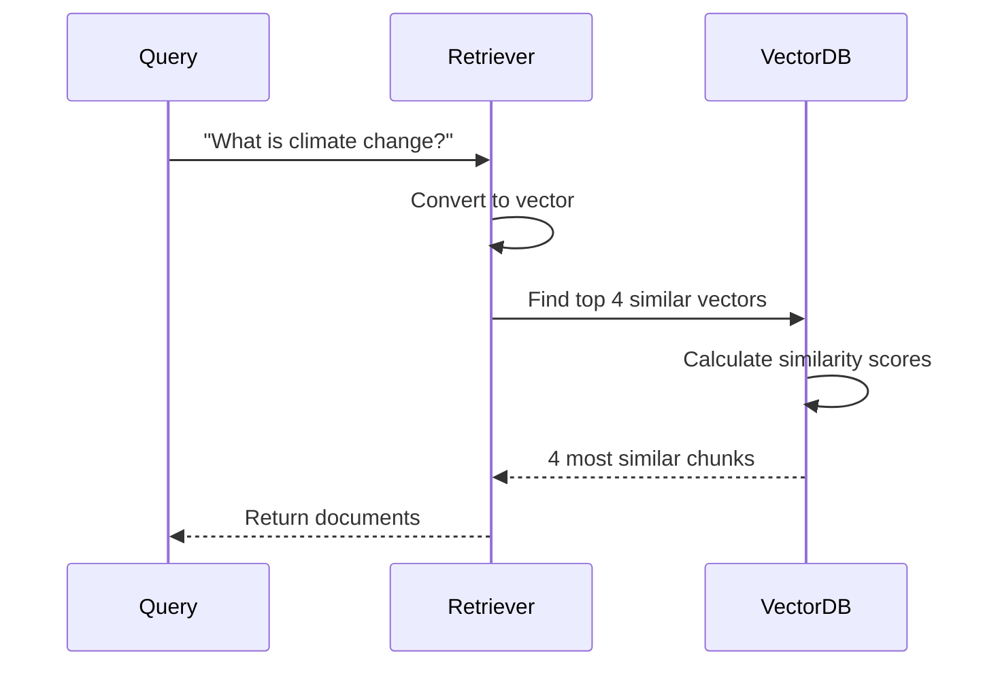
```mermaid
sequenceDiagram
    participant Query
    participant Retriever
    participant VectorDB

    Query->>Retriever: "What is climate change?"
    Retriever->>Retriever: Convert to vector
    Retriever->>VectorDB: Find top 4 similar vectors
    VectorDB->>VectorDB: Calculate similarity scores
    VectorDB-->>Retriever: 4 most similar chunks
    Retriever-->>Query: Return documents
```

**Similarity calculation:**

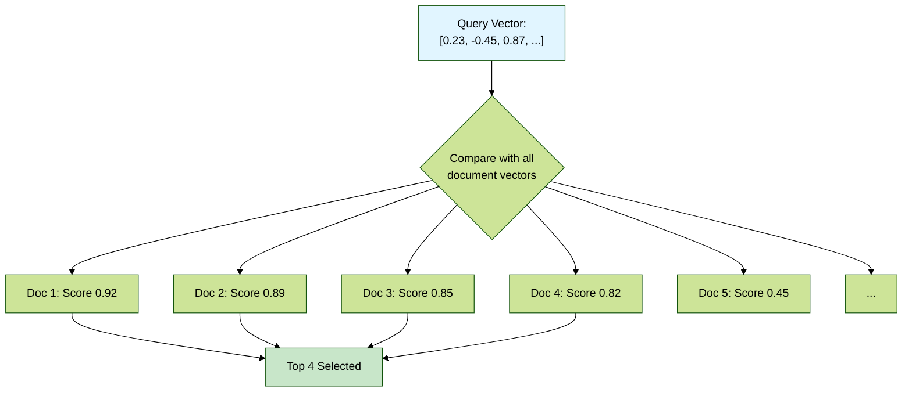
```mermaid
---
config:
  theme: 'forest'
---
graph TD
    A["Query Vector:<br/>[0.23, -0.45, 0.87, ...]"] --> B{Compare with all<br/>document vectors}

    B --> C["Doc 1: Score 0.92"]
    B --> D["Doc 2: Score 0.89"]
    B --> E["Doc 3: Score 0.85"]
    B --> F["Doc 4: Score 0.82"]
    B --> G["Doc 5: Score 0.45"]
    B --> H["..."]

    C --> I[Top 4 Selected]
    D --> I
    E --> I
    F --> I

    style A fill:#e1f5ff
    style I fill:#c8e6c9
```

### 5. Querying the System (`query` method)

**Location:** Lines 113-148

**What it does:** Processes a question and returns an answer with sources

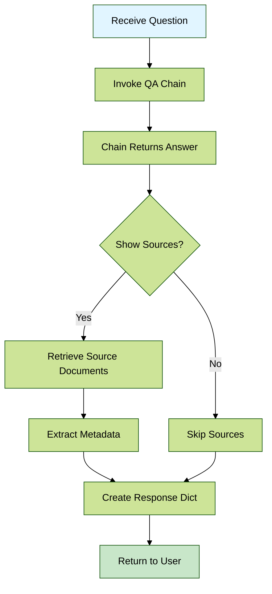
```mermaid
---
config:
  theme: 'forest'
---
flowchart TD
    A[Receive Question] --> B[Invoke QA Chain]

    B --> C[Chain Returns Answer]

    C --> D{Show Sources?}

    D -->|Yes| E[Retrieve Source Documents]
    D -->|No| F[Skip Sources]

    E --> G[Extract Metadata]
    G --> H[Create Response Dict]
    F --> H

    H --> I[Return to User]

    style A fill:#e1f5ff
    style I fill:#c8e6c9
```

**Response structure:**

```python
{
    "question": "What is climate change?",
    "answer": "Climate change refers to...",
    "sources": [
        {
            "page": 3,
            "source": "3.txt",
            "content_preview": "Climate change is caused by..."
        },
        ...
    ]
}
```

**Two-step process:**

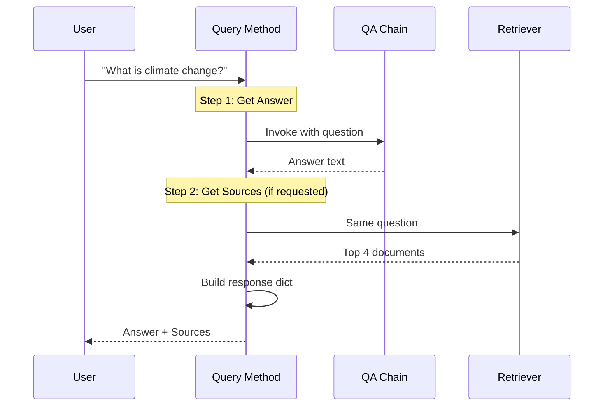
```mermaid
sequenceDiagram
    participant User
    participant Query Method
    participant QA Chain
    participant Retriever

    User->>Query Method: "What is climate change?"

    Note over Query Method: Step 1: Get Answer
    Query Method->>QA Chain: Invoke with question
    QA Chain-->>Query Method: Answer text

    Note over Query Method: Step 2: Get Sources (if requested)
    Query Method->>Retriever: Same question
    Retriever-->>Query Method: Top 4 documents

    Query Method->>Query Method: Build response dict
    Query Method-->>User: Answer + Sources
```

### 6. Interactive Mode (`interactive_mode` method)

**Location:** Lines 150-187

**What it does:** Allows continuous Q&A in a loop

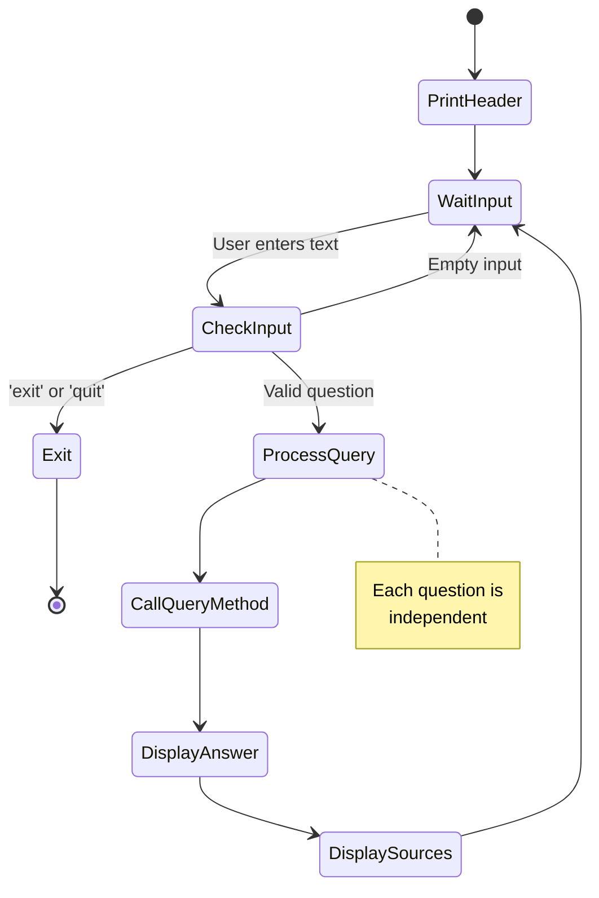
```mermaid
stateDiagram-v2
    [*] --> PrintHeader
    PrintHeader --> WaitInput

    WaitInput --> CheckInput: User enters text

    CheckInput --> Exit: 'exit' or 'quit'
    CheckInput --> WaitInput: Empty input
    CheckInput --> ProcessQuery: Valid question

    ProcessQuery --> CallQueryMethod
    CallQueryMethod --> DisplayAnswer
    DisplayAnswer --> DisplaySources
    DisplaySources --> WaitInput

    Exit --> [*]

    note right of ProcessQuery
        Each question is
        independent
    end note
```

**Example session flow:**

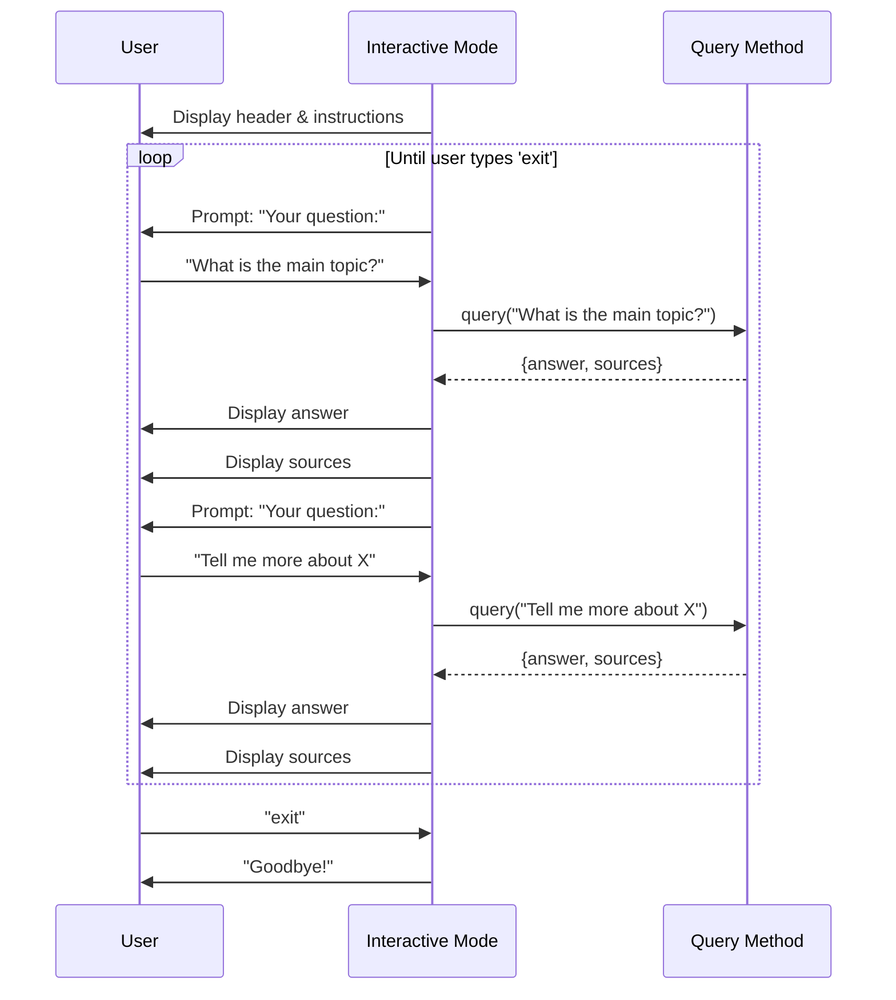
```mermaid
sequenceDiagram
    participant User
    participant Interactive Mode
    participant Query Method

    Interactive Mode->>User: Display header & instructions

    loop Until user types 'exit'
        Interactive Mode->>User: Prompt: "Your question:"
        User->>Interactive Mode: "What is the main topic?"

        Interactive Mode->>Query Method: query("What is the main topic?")
        Query Method-->>Interactive Mode: {answer, sources}

        Interactive Mode->>User: Display answer
        Interactive Mode->>User: Display sources

        Interactive Mode->>User: Prompt: "Your question:"
        User->>Interactive Mode: "Tell me more about X"

        Interactive Mode->>Query Method: query("Tell me more about X")
        Query Method-->>Interactive Mode: {answer, sources}

        Interactive Mode->>User: Display answer
        Interactive Mode->>User: Display sources
    end

    User->>Interactive Mode: "exit"
    Interactive Mode->>User: "Goodbye!"
```

### 7. Command-Line Interface (`main` function)

**Location:** Lines 190-235

**What it does:** Parses arguments and runs the application

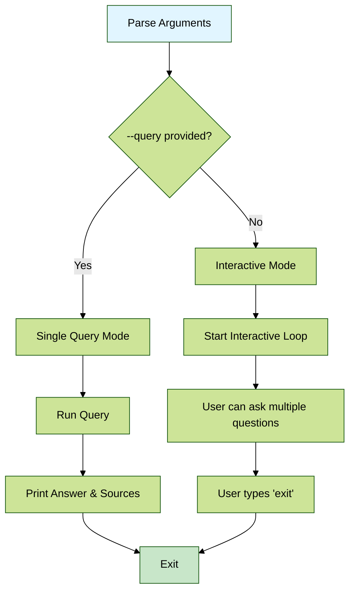
```mermaid
---
config:
  theme: 'forest'
---
flowchart TD
    A[Parse Arguments] --> B{--query provided?}

    B -->|Yes| C[Single Query Mode]
    B -->|No| D[Interactive Mode]

    C --> E[Run Query]
    E --> F[Print Answer & Sources]
    F --> G[Exit]

    D --> H[Start Interactive Loop]
    H --> I[User can ask multiple questions]
    I --> J[User types 'exit']
    J --> G

    style A fill:#e1f5ff
    style G fill:#c8e6c9
```

**Available arguments:**
- `--model`: Which LLM to use (default: llama3.2)
- `--embedding-model`: Embedding model (must match ingestion!)
- `--db-path`: Path to Chroma database
- `--ollama-url`: URL of Ollama server
- `--query`: Single question (optional)

## Query Flow

### Complete End-to-End Flow

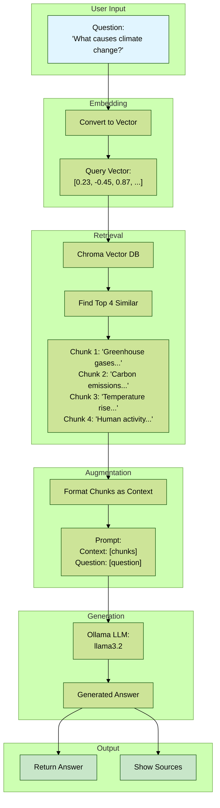
```mermaid
---
config:
  theme: 'forest'
---
flowchart TD
    subgraph "User Input"
        A[Question:<br/>'What causes climate change?']
    end

    subgraph "Embedding"
        B[Convert to Vector]
        C["Query Vector:<br/>[0.23, -0.45, 0.87, ...]"]
    end

    subgraph "Retrieval"
        D[Chroma Vector DB]
        E[Find Top 4 Similar]
        F[Chunk 1: 'Greenhouse gases...'<br/>Chunk 2: 'Carbon emissions...'<br/>Chunk 3: 'Temperature rise...'<br/>Chunk 4: 'Human activity...']
    end

    subgraph "Augmentation"
        G[Format Chunks as Context]
        H["Prompt:<br/>Context: [chunks]<br/>Question: [question]"]
    end

    subgraph "Generation"
        I[Ollama LLM:<br/>llama3.2]
        J[Generated Answer]
    end

    subgraph "Output"
        K[Return Answer]
        L[Show Sources]
    end

    A --> B
    B --> C
    C --> D
    D --> E
    E --> F
    F --> G
    G --> H
    H --> I
    I --> J
    J --> K
    J --> L

    style A fill:#e1f5ff
    style K fill:#c8e6c9
    style L fill:#c8e6c9
```

### Detailed Retrieval Process

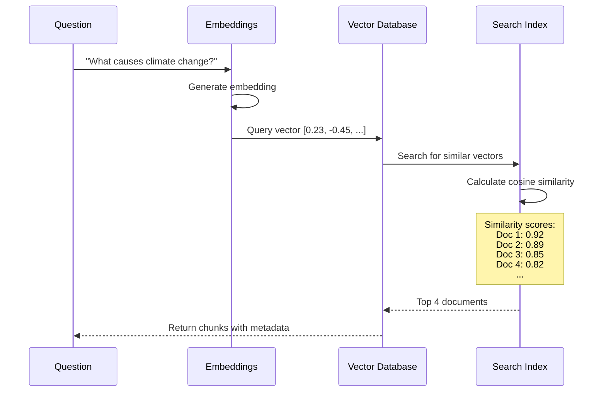
```mermaid
sequenceDiagram
    participant Q as Question
    participant E as Embeddings
    participant DB as Vector Database
    participant Idx as Search Index

    Q->>E: "What causes climate change?"
    E->>E: Generate embedding
    E->>DB: Query vector [0.23, -0.45, ...]

    DB->>Idx: Search for similar vectors
    Idx->>Idx: Calculate cosine similarity

    Note over Idx: Similarity scores:<br/>Doc 1: 0.92<br/>Doc 2: 0.89<br/>Doc 3: 0.85<br/>Doc 4: 0.82<br/>...

    Idx-->>DB: Top 4 documents
    DB-->>Q: Return chunks with metadata
```

### How Context is Built

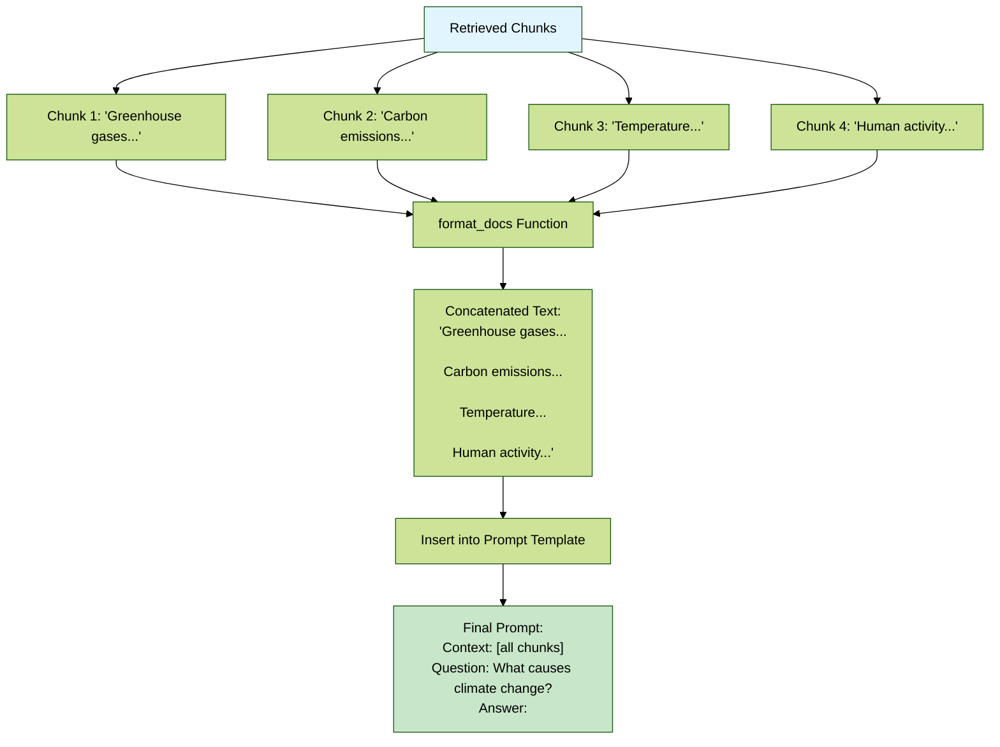
```mermaid
---
config:
  theme: 'forest'
---
graph TD
    A[Retrieved Chunks] --> B[Chunk 1: 'Greenhouse gases...']
    A --> C[Chunk 2: 'Carbon emissions...']
    A --> D[Chunk 3: 'Temperature...']
    A --> E[Chunk 4: 'Human activity...']

    B --> F[format_docs Function]
    C --> F
    D --> F
    E --> F

    F --> G["Concatenated Text:<br/>'Greenhouse gases...\n\nCarbon emissions...\n\nTemperature...\n\nHuman activity...'"]

    G --> H[Insert into Prompt Template]

    H --> I["Final Prompt:<br/>Context: [all chunks]<br/>Question: What causes climate change?<br/>Answer:"]

    style A fill:#e1f5ff
    style I fill:#c8e6c9
```

## Key Concepts Explained

### 1. Why Retrieve First, Then Generate?

Without retrieval, the LLM only knows what it learned during training:

```mermaid
---
config:
  theme: 'forest'
---
graph TD
    subgraph "Without RAG (Limited Knowledge)"
        A1[Question about<br/>YOUR document] --> B1[LLM Training Data]
        B1 --> C1[Generic Answer<br/>or 'I don't know']
    end

    subgraph "With RAG (Augmented Knowledge)"
        A2[Question about<br/>YOUR document] --> B2[Retrieve from<br/>YOUR documents]
        B2 --> C2[LLM + Context]
        C2 --> D2[Specific Answer<br/>based on YOUR data]
    end

    style C1 fill:#ffccbc
    style D2 fill:#c8e6c9
```

### 2. Temperature Setting

**Location:** Line 46

```python
temperature=0.7
```

Temperature controls randomness in LLM responses:

```mermaid
---
config:
  theme: 'forest'
---
graph LR
    A[Temperature: 0.0] --> B[Deterministic<br/>Same answer every time]
    C[Temperature: 0.7] --> D[Balanced<br/>Consistent but natural]
    E[Temperature: 1.5] --> F[Creative<br/>Varied but unpredictable]

    style D fill:#c8e6c9
```

### 3. Top-K Retrieval (k=4)

Why retrieve 4 chunks?

```mermaid
---
config:
  theme: 'forest'
---
graph TD
    A{Number of Chunks}

    A -->|k=1| B[Too Narrow<br/>Might miss context]
    A -->|k=4| C[Balanced<br/>Good coverage]
    A -->|k=10| D[Too Broad<br/>Noise & slow]

    style C fill:#c8e6c9
    style B fill:#fff9c4
    style D fill:#fff9c4
```

**Trade-offs:**

| k Value | Pros | Cons |
|---------|------|------|
| 1-2 | Fast, focused | May miss important context |
| 4-6 | Balanced, comprehensive | Good middle ground ✓ |
| 10+ | Maximum context | Slower, may include irrelevant info |

### 4. LangChain Expression Language (LCEL)

LCEL uses the `|` (pipe) operator to chain operations:

```mermaid
---
config:
  theme: 'forest'
---
graph LR
    A[Input] --> B[Operation 1]
    B -->|pipe| C[Operation 2]
    C -->|pipe| D[Operation 3]
    D --> E[Output]

    F["Code:<br/>input | op1 | op2 | op3"]

    style A fill:#e1f5ff
    style E fill:#c8e6c9
```

**Example from the code:**

```python
retriever | format_docs
```

Means: "Get documents from retriever, THEN format them"

```mermaid
sequenceDiagram
    participant Input
    participant Retriever
    participant Format

    Input->>Retriever: Question
    Retriever->>Retriever: Search database
    Retriever->>Format: [Doc1, Doc2, Doc3, Doc4]
    Format->>Format: Join with \n\n
    Format-->>Input: "Text1\n\nText2\n\nText3\n\nText4"
```

### 5. Parallel vs Sequential Execution

**RunnableParallel** runs operations concurrently:

```mermaid
---
config:
  theme: 'forest'
---
graph TD
    A[Question] --> B{RunnableParallel}

    B --> C[Task 1:<br/>Retrieve Context]
    B --> D[Task 2:<br/>Pass Question]

    C --> E[Both complete]
    D --> E

    E --> F[Continue Chain]

    style A fill:#e1f5ff
    style E fill:#c8e6c9

    Note1[Runs at same time<br/>for efficiency]
```

Without parallel execution:

```mermaid
---
config:
  theme: 'forest'
---
graph TD
    A[Question] --> B[Task 1:<br/>Retrieve Context]
    B --> C[Wait...]
    C --> D[Task 2:<br/>Pass Question]
    D --> E[Continue Chain]

    Note1[Sequential = Slower]

    style A fill:#e1f5ff
    style Note1 fill:#ffccbc
```

## Example Usage

### Interactive Mode (Recommended)

```bash
python rag_app.py
```

**What happens:**

```mermaid
sequenceDiagram
    participant User
    participant App

    App->>User: RAG Application - Interactive Mode
    App->>User: Type 'exit' to quit

    loop Question & Answer
        App->>User: Your question:
        User->>App: What is the main topic?
        App->>User: Thinking...
        App->>User: Answer: The main topic is...
        App->>User: Sources: [Page 3, Page 7]
    end

    User->>App: exit
    App->>User: Goodbye!
```

### Single Query Mode

```bash
python rag_app.py --query "What is the main topic?"
```

### With Custom Model

```bash
python rag_app.py --model llama3.1
```

## Architecture Overview

### System Components

```mermaid
---
config:
  theme: 'forest'
---
graph TD
    subgraph "RAG Application"
        A[User Interface<br/>CLI]
        B[RAGApplication Class]
        C[Query Method]
    end

    subgraph "LangChain Components"
        D[Embeddings]
        E[Retriever]
        F[Prompt Template]
        G[LLM]
        H[Output Parser]
    end

    subgraph "External Services"
        I[Ollama Server]
        J[Chroma Database]
    end

    A --> B
    B --> C
    C --> D
    C --> E
    C --> F
    C --> G
    C --> H

    D --> I
    E --> J
    G --> I

    style A fill:#e1f5ff
    style J fill:#fff9c4
    style I fill:#fff9c4
```

### Data Flow Architecture

```mermaid
---
config:
  theme: 'forest'
---
flowchart TD
    subgraph "Input Layer"
        A[User Question]
    end

    subgraph "Processing Layer"
        B[Embedding Generation]
        C[Vector Search]
        D[Context Assembly]
        E[Prompt Construction]
    end

    subgraph "Generation Layer"
        F[LLM Processing]
        G[Answer Generation]
    end

    subgraph "Output Layer"
        H[Answer]
        I[Source Citations]
    end

    subgraph "Storage Layer"
        J[(Chroma DB<br/>Vectors & Text)]
    end

    A --> B
    B --> C
    C --> J
    J --> C
    C --> D
    D --> E
    E --> F
    F --> G
    G --> H
    G --> I

    style A fill:#e1f5ff
    style H fill:#c8e6c9
    style I fill:#c8e6c9
```

## Comparison: Before and After RAG

### Traditional Question Answering

```mermaid
---
config:
  theme: 'forest'
---
graph LR
    A[Question] --> B[LLM]
    B --> C[Answer from<br/>training data only]

    D[Limitations:<br/>❌ No access to your docs<br/>❌ May hallucinate<br/>❌ No sources]

    style C fill:#ffccbc
    style D fill:#ffccbc
```

### RAG Question Answering

```mermaid
---
config:
  theme: 'forest'
---
graph TD
    A[Question] --> B[Vector Search]
    B --> C[Your Documents]
    C --> D[Relevant Chunks]
    D --> E[LLM + Context]
    E --> F[Answer from YOUR data]

    G[Benefits:<br/>✓ Uses your documents<br/>✓ Grounded in facts<br/>✓ Provides sources<br/>✓ Reduces hallucination]

    style F fill:#c8e6c9
    style G fill:#c8e6c9
```

## Summary

The RAG application enables intelligent question-answering by:

1. **Converting** your question to a vector embedding
2. **Searching** the database for similar text chunks
3. **Retrieving** the top 4 most relevant pieces of information
4. **Combining** the retrieved context with your question
5. **Generating** an answer using a language model
6. **Returning** the answer along with source citations

This approach ensures answers are grounded in your actual documents rather than the LLM's training data, providing accurate and verifiable responses!

### Key Advantages

```mermaid

mindmap
    root((RAG Benefits))
        Accuracy
            Answers from your docs
            Reduces hallucination
            Fact-based responses
        Transparency
            Shows sources
            Traceable to pages
            Verifiable claims
        Flexibility
            Works with any docs
            Multiple models
            Customizable prompts
        Privacy
            Runs locally
            No data sent to cloud
            Full control
```

Now you can ask questions about your documents and get intelligent, sourced answers!
